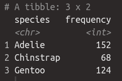
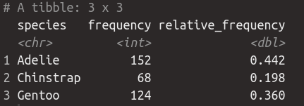

Take the yourname_starter_code_01.R and replace "yourname" with your name.

1. Using the penguins dataset, create a frequency table showing the count of observations by species. The output should look similar to this: 

2. Then take the result and add a column showing the relative frequency of each species. The output should look similar to this:

When finished (or at the end of the time limit), submit your responses to: https://docs.google.com/forms/d/e/1FAIpQLSfOVIUPV2FpxeO_SajtFOmyvnkN1TJVMqYYBL83QSO5I3iLSA/viewform?usp=sf_link