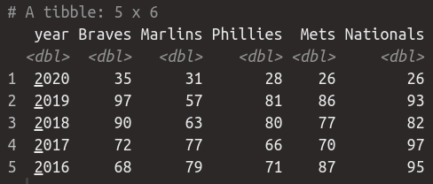
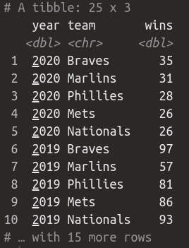
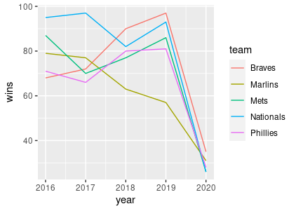
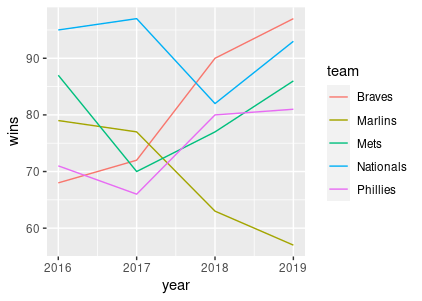

1. The starter code creates a tibble `nl_east`, that looks like

Reformat it so that it is formatted like this (make sure that you get the correct column names):

2. Take the result from the first part and create a line chart showing the number of wins each get had per year. The result should look like this:

Due to a shortened season, the number of wins per team dropped severely in 2020. Redo your plot but remove 2020 so that it is easier to see trends in the other 4 years.

When finished (or at the end of the time limit), submit your responses to: https://docs.google.com/forms/d/e/1FAIpQLSd9hDS4DzmLoJkLJqGn4bgcso6XSOSvgqsLr2xuHNc8MH53VQ/viewform?usp=sf_link