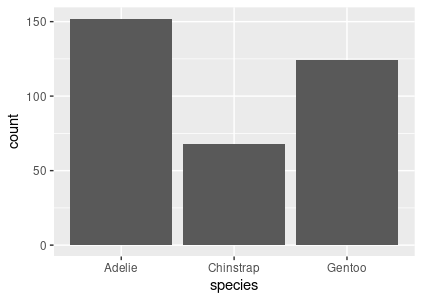
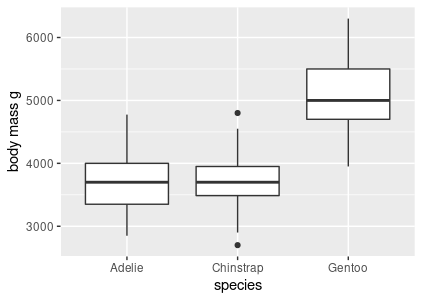
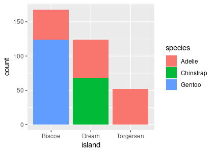
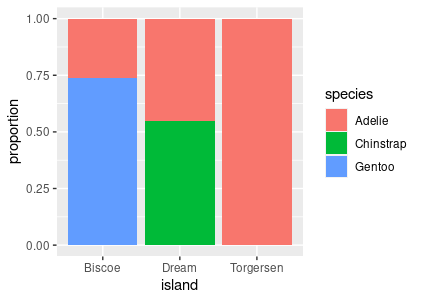

The starter code provides some incorrect code to generate plots using the penguins data.

1. Fix the code so that you get a bar chart showing the count of penguins by species.

2. Fix the second plot so that you get box plots showing the distributions of body mass per species.

3. The final plot does work and gives a bar chart showing number of penguins per island. Adjust it so that each bar is subdivided into species.

Also, try to adjust your plot so that you are showing proportions of species per island, rather than counts.

When finished (or at the end of the time limit), submit your responses to: https://docs.google.com/forms/d/e/1FAIpQLSdxfHuW7WCU3-g2wiqIU0j70HHFr2JCOPquw-RgyevOosdXbg/viewform?usp=sf_link